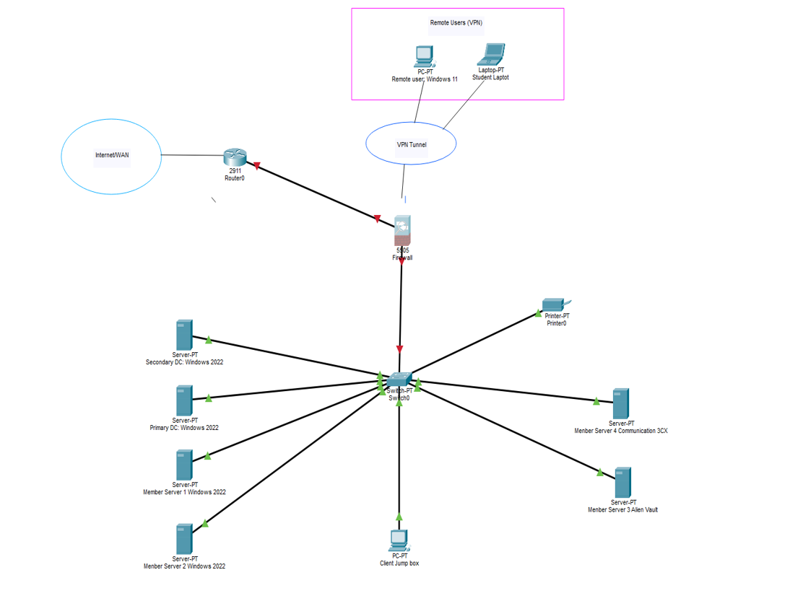

# 🖥️ Windows Server 2022 & Active Directory Home Lab

## 📖 Overview

This project documents the deployment and configuration of a Windows Server 2022 home lab built to develop practical skills in Windows infrastructure, system administration, networking, and cybersecurity.

The lab simulates a small business environment and demonstrates core technologies commonly used in enterprise IT.

---

## 🎯 Objectives

- Deploy a Windows Server 2022 Domain Controller
- Configure Active Directory Domain Services (AD DS)
- Create users, groups and Organizational Units (OUs)
- Configure DNS and DHCP
- Deploy Group Policy Objects (GPOs)
- Configure file sharing and NTFS permissions
- Join Windows 11 clients to the domain
- Practice common IT administration tasks

---

## 🛠 Technologies Used

- Windows Server 2022
- Windows 11
- Active Directory Domain Services
- DNS
- DHCP
- Group Policy
- VMware
- PowerShell
- NTFS Permissions

---

## 🌐 Lab Topology

The diagram below illustrates the virtual enterprise network used throughout this home lab. It includes a Windows Server 2022 domain environment, network infrastructure, VPN access, and supporting services.

<p align="center">
  
</p>

---

## 📷 Screenshots

Screenshots of the lab environment will be added as the project progresses.

---

## 📂 Project Structure

```text
Windows-Server-Active-Directory-Lab
│
├── README.md
├── documentation/
│   └── README.md
│
└── images/
    ├── README.md
    └── image.png
```

---

## 📚 Skills Demonstrated

- Active Directory administration
- Windows Server deployment
- DNS configuration
- DHCP configuration
- Group Policy management
- User and permission management
- Windows troubleshooting
- Virtual machine administration

---

## 🚀 Project Status

🟡 In Progress

This repository will continue to grow as I expand my Windows Server and Active Directory home lab.
